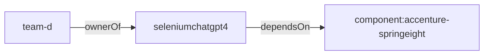

# seleniumchatgpt4 Documentation

## 1. Prompt 

### 1.1. Description

Creación de Scripts automáticos a partir de los test cases de la descripción

```raw
Title: Selenium Test Automation Prompt for QA Engineer

Description:
As a QA engineer, I want to automate a test scenario using Selenium, a popular web application testing framework. The objective is to create a Java class that performs automated testing on a web application. The test scenario involves the following steps:

1. Launch the web browser (Chrome/Firefox) and navigate to the application URL.
2. Verify that the homepage is loaded successfully by checking for specific elements such as the logo, navigation menu, or any other unique identifiers.
3. Log in to the application using valid credentials (username and password).
4. Validate the successful login by verifying that the user is redirected to the expected landing page or dashboard.
5. Search for a specific item/product on the application's search functionality.
6. Verify that the search results page displays the relevant items/products based on the search query.
7. Click on a specific item/product from the search results.
8. Verify that the item/product details page is displayed correctly, including its title, description, price, and any other relevant information.
9. Add the item/product to the cart or wishlist.
10. Validate that the item/product is added successfully by checking the cart or wishlist count, or any relevant indicators.
11. Perform a checkout process (if applicable) by navigating to the checkout page and filling in the required information (shipping address, payment details, etc.).
12. Verify that the checkout process is completed successfully by confirming the order confirmation or payment success message.
13. Log out from the application.
14. Validate the successful logout by verifying that the user is redirected to the login page or any other appropriate page.

Please generate a Java class that utilizes Selenium WebDriver to automate this test scenario. Feel free to use any necessary helper methods, assertions, or waits to ensure stable test execution. Remember to include proper exception handling and appropriate comments for clarity.
```

### 1.2. Diagrama de Dependencias


### 1.3 Resultado

```java
import org.openqa.selenium.*;
import org.openqa.selenium.chrome.ChromeOptions;
import org.openqa.selenium.remote.DesiredCapabilities;
import org.openqa.selenium.remote.RemoteWebDriver;
import java.net.URL;

public class SeleniumGridTestAutomation {
    private WebDriver driver;

    public void setup() throws Exception {
        // Define the URL of the Selenium Grid hub
        String gridHubUrl = "http://grid_hub_ip:4444/wd/hub";

        // Set the path to the driver executable (e.g., chromedriver)
        System.setProperty("webdriver.chrome.driver", "path/to/chromedriver");

        // Define the desired capabilities for Chrome browser
        DesiredCapabilities capabilities = DesiredCapabilities.chrome();
        ChromeOptions options = new ChromeOptions();
        options.setCapability(ChromeOptions.CAPABILITY, options);
        capabilities.setBrowserName("chrome");

        // Initialize the driver using RemoteWebDriver and connect to the Selenium Grid hub
        driver = new RemoteWebDriver(new URL(gridHubUrl), capabilities);
    }

    public void runTest() {
        try {
            // Step 1: Launch the web browser and navigate to the application URL
            driver.get("https://www.example.com");

            // Step 2: Verify that the homepage is loaded successfully
            WebElement logo = driver.findElement(By.cssSelector(".logo"));
            WebElement navigationMenu = driver.findElement(By.cssSelector(".navigation-menu"));

            // Step 3: Log in to the application using valid credentials
            WebElement usernameField = driver.findElement(By.id("username"));
            WebElement passwordField = driver.findElement(By.id("password"));
            WebElement loginButton = driver.findElement(By.cssSelector(".login-button"));

            usernameField.sendKeys("your_username");
            passwordField.sendKeys("your_password");
            loginButton.click();

            // Step 4: Validate the successful login
            WebDriverWait wait = new WebDriverWait(driver, 10);
            wait.until(ExpectedConditions.urlToBe("https://www.example.com/dashboard"));

            // Step 5: Search for a specific item/product
            WebElement searchField = driver.findElement(By.id("search"));
            WebElement searchButton = driver.findElement(By.cssSelector(".search-button"));

            searchField.sendKeys("your_search_query");
            searchButton.click();

            // Step 6: Verify the search results page
            wait.until(ExpectedConditions.visibilityOfElementLocated(By.cssSelector(".search-results")));

            // Step 7: Click on a specific item/product
            WebElement productLink = driver.findElement(By.cssSelector(".product-link"));
            productLink.click();

            // Step 8: Verify the item/product details page
            wait.until(ExpectedConditions.visibilityOfElementLocated(By.cssSelector(".product-details")));

            // Step 9: Add the item/product to the cart or wishlist
            WebElement addToCartButton = driver.findElement(By.cssSelector(".add-to-cart-button"));
            addToCartButton.click();

            // Step 10: Validate the successful addition of the item/product
            wait.until(ExpectedConditions.visibilityOfElementLocated(By.cssSelector(".cart-count")));

            // Step 11: Perform the checkout process
            WebElement checkoutButton = driver.findElement(By.cssSelector(".checkout-button"));
            checkoutButton.click();

            // Step 12: Verify the successful checkout process
            wait.until(ExpectedConditions.visibilityOfElementLocated(By.cssSelector(".order-confirmation")));

            // Step 13: Log out from the application
            WebElement logoutButton = driver.findElement(By.cssSelector(".logout-button"));
            logoutButton.click();

            // Step 14: Validate the successful logout
            wait.until(ExpectedConditions.urlToBe("https://www.example.com/login"));

            System.out.println("Test completed successfully.");
        } catch (TimeoutException e) {
            System.err.println("Test failed due to a timeout: " + e.getMessage());
        } catch (NoSuchElementException e) {
            System.err.println("Test failed due to a missing element: " + e.getMessage());
        } catch (Exception e) {
            System.err.println("Test failed: " + e.getMessage());
        } finally {
            // Quit the driver and close the browser
            driver.quit();
        }
    }

    public static void main(String[] args) throws Exception {
        SeleniumGridTestAutomation test = new SeleniumGridTestAutomation();
        test.setup();
        test.runTest();
    }
}

```

## 2. Selenium Grid

Docker images for the Selenium Grid Server
The project is made possible by volunteer contributors who have put in thousands of hours of their own time, and made the source code freely available under the Apache License 2.0.

These Docker images come with a handful of tags to simplify its usage, have a look at them in one of our releases.

To get notifications of new releases, add yourself as a "Releases only" watcher.

These images are published to the Docker Hub registry at Selenium Docker Hub.

### 2.1 Installation

Use the package manager [pip](https://pip.pypa.io/en/stable/) to install foobar.

```chrome
docker run -d -p 4444:4444 --shm-size="2g" selenium/standalone-chrome:4.8.2-20230325
```
```firefox
docker run -d -p 4444:4444 --shm-size="2g" selenium/standalone-firefox:4.8.2-20230325
```
```edge
docker run -d -p 4444:4444 --shm-size="2g" selenium/standalone-edge:4.8.2-20230325
```

### 2.2 Usage

```bash
# Install Selenium Grid Mesh
docker-compose -f docker-compose-v3.yml up -d --scale chrome=3 --scale firefox=3 --scale edge=1

# test project execution
 mvn -s settings.xml clean package

```

### 2.3 Contributing

Pull requests are welcome. For major changes, please open an issue first
to discuss what you would like to change.

Please make sure to update tests as appropriate.

### 2.4 License

[ Apache License 2.0.](https://choosealicense.com/licenses/mit/)
